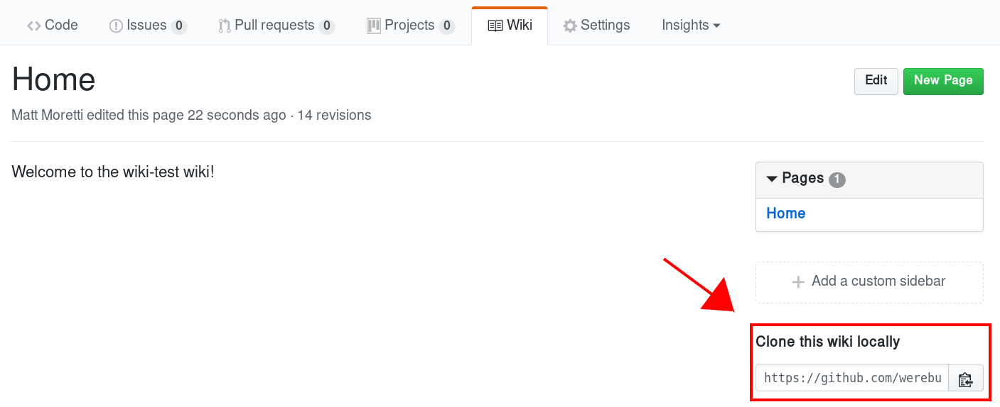

This project contains a handful of `rake` tasks that can be run in a local
clone of a GitHub wiki to automate page categorization, custom formatting,
etc.

Installation
============

Clone your wiki's git repository locally. The clone URL can be found in the
sidebar below the page list.



From within your local clone, run the following:

```bash
$ curl -L https://github.com/umts/wiki-scripts/archive/master.tar.gz | \
  tar -xz --strip-components=1 --exclude=Readme.md
```

Finally, you'll want to add, commit, and push the new files in your wiki. None
of the files from this project will show up online in your wiki, Gollum ignores
unknown file types, as well as files that start with underscores (with the
exception of `_Footer` and `_Sidebar`).

Tasks
=====

*  `rake wiki:setup` - Make sure required directories and files exist. This
   task is a prerequisite of the others; you probably won't need to run it
   directly.
*  `rake wiki:categories` - Executes `wiki:categories:build` and
   `wiki:categories:index` below.
*  `rake wiki:categories:build` - Builds a page in the `category-pages/`
   directory for each "tag" in the metadata. See below.
*  `rake wiki:categories:index` - Updates the "Home" page with a list of the
   categories in the wiki.
*  `rake wiki:images` - Replaces short image tags with full links to the raw
   GitHub address.

Categorizing Pages
==================

Pages are categorized using some YAML metadata. Place the following somewhere
in your page - I suggest at the end.

```
<!--
---
tags: [array, of, category, names]
-->
```

Modifying Category Pages
========================

The resulting category pages will have a line on them that looks like

```
<!-- +++ -->
```

Anything you place **above** that line will be preserved when the category
pages are regenerated. Unused category pages are usually deleted, but will
be preserved if there is any custom content above this line.

Images
======

You can place images in the `images/` directory which is created for you by
the `wiki:setup` task. Then, in your markdown, refer to them like this:

```markdown

```

The text inside the `{}`s is the file *name* only, no directory name. It will
be replaced by an address that looks like the following

```markdown

```
